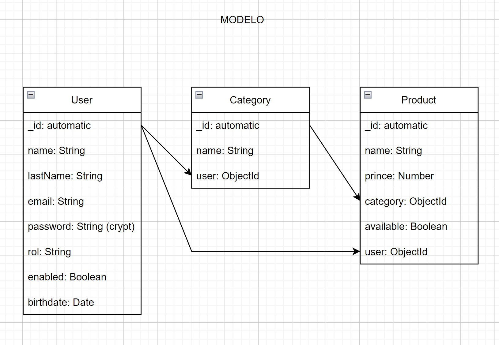

# API de Login de usuarios, creación , eliminación, actualización y obtención completa o filtrada de usuarios.


## Installation

Install the dependencies and devDependencies and start the server.

```sh
cd dillinger
npm i
node app
```

For production environments...

```sh
npm run dev 
```


-----------------------------------------------------


| Dependencias |
| ------ |
| nodemon | 
| dotenv | 
| express | 
| express-validator | 
| morgan | 
| mongoose |
| mongoose-paginate-v2 |
| mongoose-unique-validator |
| swagger-ui-express |
| bcrypt |
| jsonwebtoken |


-----------------------------------------------------

# PROGRAMAS

- Google Chrome
- Visual Studio Code
- Postman
- Mongo Compass
- Git
- Node JS
- Nodemon

-----------------------------------------------------
# Modelo




*Category in procces
*Product in procces

-----------------------------------------------------
# Documentación Swagger 


-----------------------------------------------------
# Postman Test 


-----------------------------------------------------

```sh
package.json
.gitignore
.env
postman
src
   |__config 
   |  |__index.js
   |
   |__constants
   |  |__index.js
   |
   |__controllers
   |  |__users.js
   |  |__auth.js
   |
   |__errors
   |  |__appError.js
   |
   |__handlers
   |  |__successHandler.js
   |
   |__loaders
   |  |
   |  |__logger
   |  |  |__index.js
   |  |
   |  |
   |  |__mongoose
   |  |  |__index.js
   |  |
   |  |__ server
   |  |  |__expressServerjs
   |  |
   |  |__swagger
   |  |  |
   |  |  |__swagger.json
   |  |
   |  |__index.js
   |
   |__middlewares
   |  |
   |  |__auth
   |  |  |__index.js
   |  |
   |  |__users
   |  |  |__index.js 
   |  |
   |  |__commons.js
   |
   |__models
   |  |__users.js
   |
   |__repositories
   |  |__usersRepository.js
   |
   |__routes
   |  |__users.js
   |
   |__services
      |__index.js   
```

config -> Propiedades de configuracion(PUERTO,DB)

controllers -> CRUD DE USUARIOS QUE LO UNO CON EL MODELO

loaders -> VOY A TENER TODO LO NECESARIO ANTES QUE SE INICIE LA APP(librerias,clases,etc)

logger -> 

server ->CONFIGURACION DE COMO LEVANTAR EL SERVER EXPRESS

swagger ->DOCUMENTACIÓN

src/loaders/index.js -> INICIALIZACIÓN DEL PROYECTO

models -> CREO EL SCHEMA

routes -> VOY A CONFIGURAR LAS RUTAS
(en proceso de terminar)


-----------------
